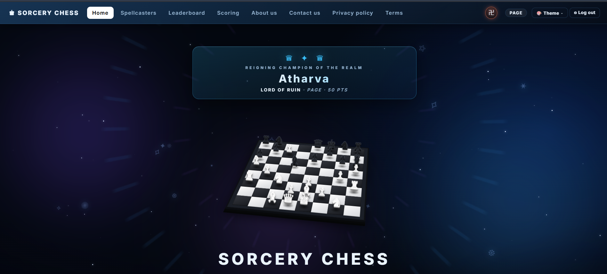

# ♟ Sorcery Chess

A two-player chess variant played on a **12 × 12 board** with four unique **spellcaster pieces** — each with a special ability that changes the game entirely. Built as a pure static web app: zero dependencies, no build step, opens straight from `file://`.



---

## ✨ Features

- **12 × 12 Sorcery mode** — the full spellcaster experience
- **Classic 8 × 8 mode** — standard chess, reusing the same engine
- **Four spellcasters** with unique abilities:
  - 🧙 **Wizard** — poisons an enemy and swaps places (4 charges)
  - ⚗️ **Alchemist** — cures a poisoned ally and swaps
  - ❄️ **Freezer** — freezes an enemy for 3 moves and swaps
  - 🧟 **Witch** — revives a graveyard piece onto her square and dies in its place
- **AI opponent** — 5 difficulty levels (Apprentice → The Dominion), including a real alpha-beta engine at levels 3–5
- **Online multiplayer** — peer-to-peer via PeerJS WebRTC, no server needed
- **Chess clock** — 5-minute game clock with +2s increment per move
- **6 visual themes** — Obsidian (default), Daylight, Crimson, Sapphire, Emerald, Amethyst
- **3D board** with smooth 2D ↔ 3D camera toggle and fullscreen mode
- **Rating ladder** — 17 ranks (Junior → The Monarch), per-variant scoring
- **Worldwide Leaderboard** — compete against legendary NPC mages and local accounts
- **Spellcasters Codex** — animated spell demos, lore, and stat cards for each piece
- **Sound effects** — synthesized via Web Audio API (no audio files)
- **Local accounts** — sign up / log in, persisted in localStorage with SHA-256 hashed passwords

---

## 🚀 Running Locally

No install required. Just serve the folder:

```bash
python -m http.server 8123
```

Then open http://localhost:8123.

Or open `index.html` directly from disk — it works from `file://` too.

---

## 🗂 Project Structure

```
sorcerychess/
├── index.html              # Main SPA shell
├── about.html              # Standalone MPA pages (SEO-friendly)
├── contact.html
├── privacy.html
├── terms.html
├── codex.html
├── leaderboard.html
├── points.html
├── profile.html
├── 404.html / 500.html
├── css/
│   ├── base.css            # Design tokens, layout
│   ├── home.css            # Hero, rank card, explore band
│   ├── board.css           # Board, pieces, graveyard
│   ├── components.css      # Modals, navbar, overlays
│   ├── leaderboard.css
│   ├── variant.css
│   ├── points.css
│   ├── themes.css          # Six colour skins
│   └── responsive.css      # Breakpoints
├── js/
│   ├── state.js            # Constants + global mutable state
│   ├── rules.js            # Move/ability generation, newGame
│   ├── sound.js            # Web Audio SFX
│   ├── persistence.js      # Save/load (localStorage)
│   ├── check.js            # Check/mate detection
│   ├── turn.js             # doMove / doAbility / endTurn
│   ├── clock.js            # Chess clock
│   ├── render.js           # Board DOM rebuild, animations
│   ├── ui.js               # Modals, camera, fullscreen, toast
│   ├── theme.js            # Theme switching
│   ├── ai.js               # AI engine (alpha-beta, levels 1-5)
│   ├── account.js          # Users, ranks, points, stats
│   ├── hierarchy.js        # Hall of Ascension + page router
│   ├── leaderboard.js      # Worldwide Leaderboard
│   ├── online.js           # PeerJS WebRTC online play
│   ├── fx.js               # Fate waiver, music, dark summoning
│   └── boot.js             # Entry point — auth wiring, init
├── sitemap.xml
├── robots.txt
├── _headers                # Cloudflare security headers
└── wrangler.jsonc          # Cloudflare Pages deploy config
```

> Scripts share one global scope and must be loaded in the order listed above. No bundler or import/export.

---

## 🌐 Deployment

Deploys as a static asset bundle via Cloudflare Pages:

```bash
npx wrangler deploy
```

For 404/500 handling on nginx:

```nginx
error_page 404 /404.html;
error_page 500 /500.html;
```

---

## 📬 Contact Form

`contact.html` posts directly to Web3Forms — no backend needed. Replace `ACCESS_KEY` near the top of its inline script with your own key from web3forms.com.

---

## 📄 License

MIT © 2026 Atharva Shukla
